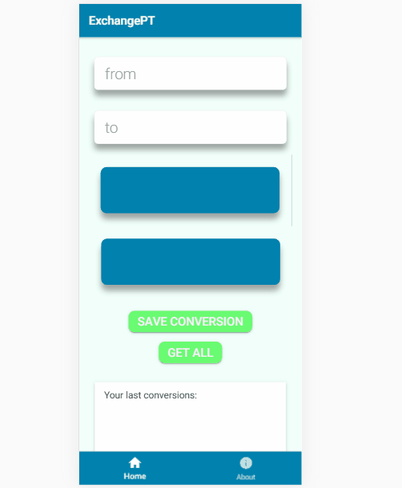

# Mobile App Development project 2019
Ionic 3 app that converts amounts between different currencies using an API to get the most recent exchange rates.

### Prerequisites

You need ionic installed to run this app

To get started with Ionic, first make sure you have Node.js installed.

Next, install the latest Cordova and Ionic command line tool as shown below:

```
npm install -g cordova ionic
```

## Getting Started

After cloning the repository, run the following from your Terminal (Mac / Linux) or Command Prompt (Windows), with the project as your current working directory.

```
ionic serve
```
## User Guide

When the app initializes pick the currency to convert from and the currency to convert to as showed on the gif.

You can then save the conversion by clicking the save button. You can also press the get button to get your 10 previous convertions.



You can also navigate between pages with the tab navigator at the bottom of the screen as shown in the gif bellow.


